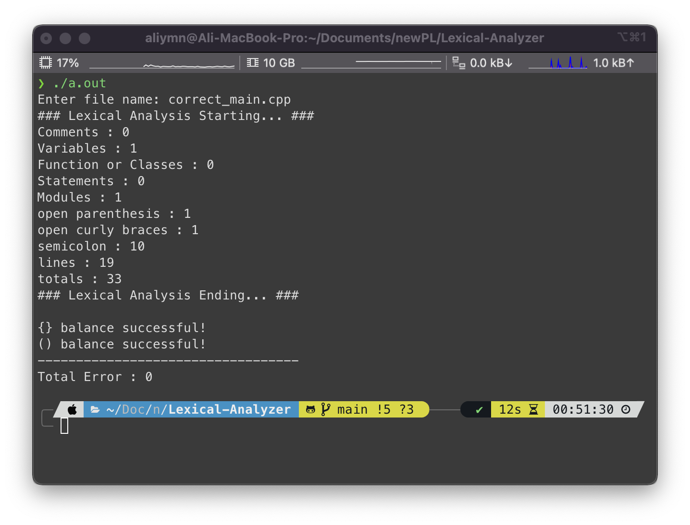

# Lexical-Analyzer

This project has been prepared for a programming languages course project. It simply performs c++ word analysis and simple syntax checking.

# Build & Run

    g++ lex.cpp
    ./a.out

# Demo

I will show two sample demos.

Input : Syntax is an example of code that is not found faulty. ;

    #include <iostream>
    using namespace std;

    int main()
    {
        int a = 5, b = 10, temp;

        cout << "Before swapping." << endl;
        cout << "a = " << a << ", b = " << b << endl;

        temp = a;
        a = b;
        b = temp;

        cout << "\nAfter swapping." << endl;
        cout << "a = " << a << ", b = " << b << endl;

        return 0;
    }

Input : It is a code sample with a syntax error.

    // Test C++ Program
    #include <iostream>

    int main() {
    std::cout << "Hello World!";
    while (/* condition */
    {
    /* code */
    }
    if (/* condition */
    {
    /* code */
    
    for (size_t i = 0; i < count; i++
    {
    /* code */
    }
    return 0;
    }

